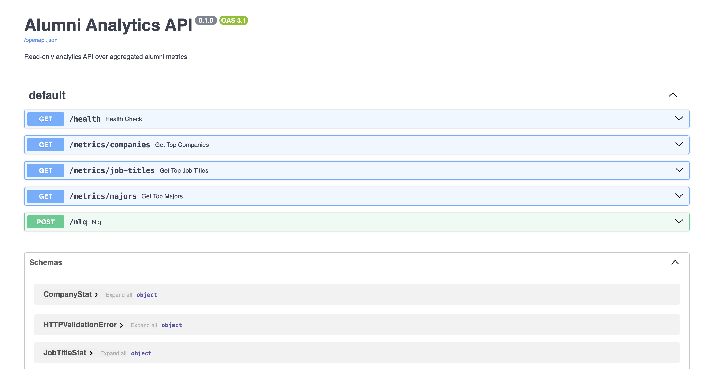
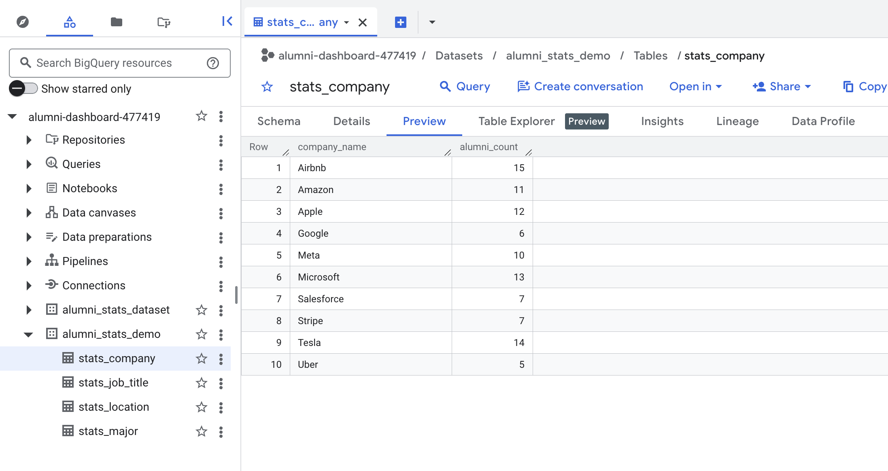
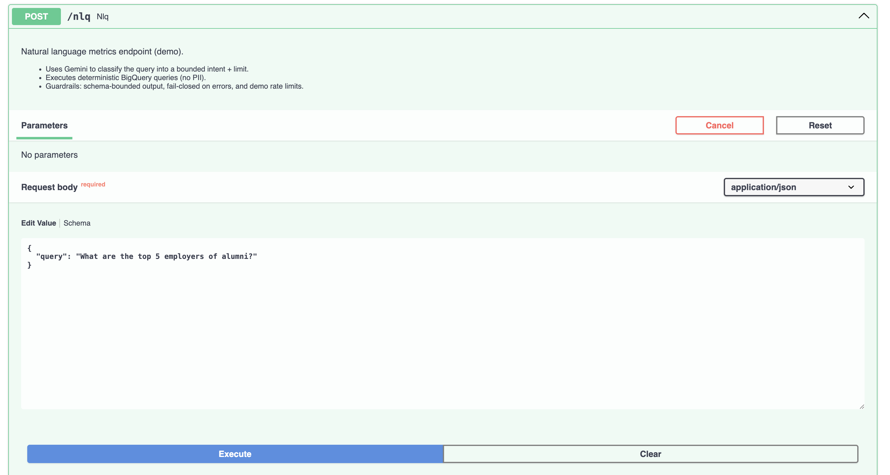
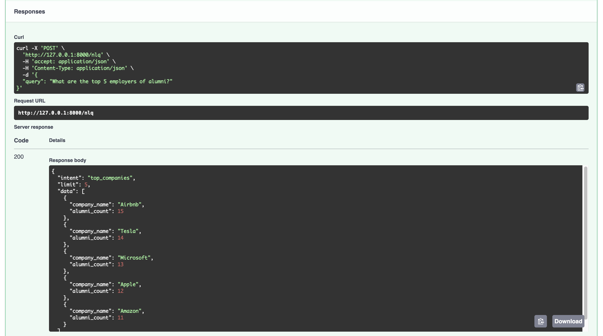
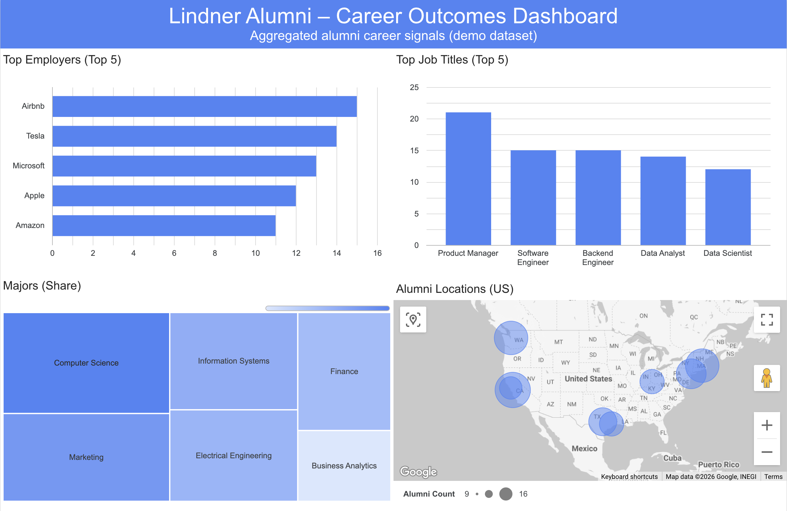

# Alumni Analytics ETL + Metrics API (Demo)

A demo-ready analytics platform that transforms alumni records into privacy-safe aggregate metrics in BigQuery, exposes a read-only FastAPI metrics API, and includes a thin NL-to-intent AI layer (Gemini) that routes to deterministic queries.

## 30-second scan

### What this system does
- Ingests alumni records from a demo CSV (synthetic, no PII) or Airtable (prod mode)
- Applies schema gating + deterministic transforms to produce aggregate metrics tables
- Loads aggregates into BigQuery (demo dataset) for dashboards and API queries
- Exposes read-only metrics endpoints via FastAPI
- Supports NL queries by classifying intent into a bounded contract, then executing deterministic BigQuery queries (fail-closed + rate guard)

### Architecture
CSV/Airtable → Extract → Schema gate (SAFE_COLUMNS) → Transforms → BigQuery tables  
FastAPI → /metrics/* → BigQuery  
FastAPI → /nlq → Gemini intent classifier → deterministic BigQuery query

This design enforces a strict separation between data processing, analytics, and serving layers.

## Evidence (Demo Proof)

This section provides quick, verifiable signals that the system is functional end-to-end.

### 1) FastAPI interactive docs
Shows all available endpoints and response schemas.



---

### 2) BigQuery demo dataset
Aggregated metrics written by the ETL (demo mode).



---

### 3) NLQ example (AI thin layer)
Natural language → bounded intent → deterministic BigQuery query.

**Input**
```json
{ "query": "What are the top 5 employers of alumni?" }
```
**Output**
```json
{
  "intent": "top_companies",
  "limit": 5,
  "data": [...]
}
```




## Career Outcomes Dashboard (Demo)

This dashboard is built directly on the BigQuery aggregate tables produced by the ETL pipeline.
It demonstrates the full data flow from source → transformations → analytics layer → API → visualization.

**Purpose**
- Show that the pipeline outputs are immediately usable by BI tools
- Validate schema stability and aggregate correctness
- Provide a human-readable “end state” for the platform

**Data source**
- BigQuery dataset: `alumni_stats_demo`
- Tables:
  - `stats_company`
  - `stats_job_title`
  - `stats_major`
  - `stats_location`

**What it shows**
- **Top Employers (Top 5)**: Which companies alumni most frequently work at  
- **Top Job Titles (Top 5)**: Most common roles among alumni  
- **Majors (Share)**: Distribution of academic backgrounds  
- **Alumni Locations (US)**: Geographic concentration by state

> All data is synthetic (demo mode) and privacy-safe.  
> No raw or personally identifiable information is exposed.



## Reliability / trust signals
- CI: pytest runs on every push / PR
- STATUS.md: latest run snapshot
- RUNBOOK.md: expected failure modes + recovery steps
- Fail-closed AI: schema-bounded intent classification + in-process RPM/RPD guard

## Quickstart (demo)
> Requires a Google Cloud project with BigQuery enabled and a service account key.
```bash
# 1) Generate synthetic demo data
python scripts/generate_demo_data.py --rows 100

# 2) Run demo ETL (writes to BigQuery demo dataset)
DATA_MODE=demo DATA_SOURCE=csv python main.py

# 3) Run API locally
uvicorn api.main:app --reload

# After starting the API:
# Health check
curl http://127.0.0.1:8000/health

# Interactive API docs
http://127.0.0.1:8000/docs
```

